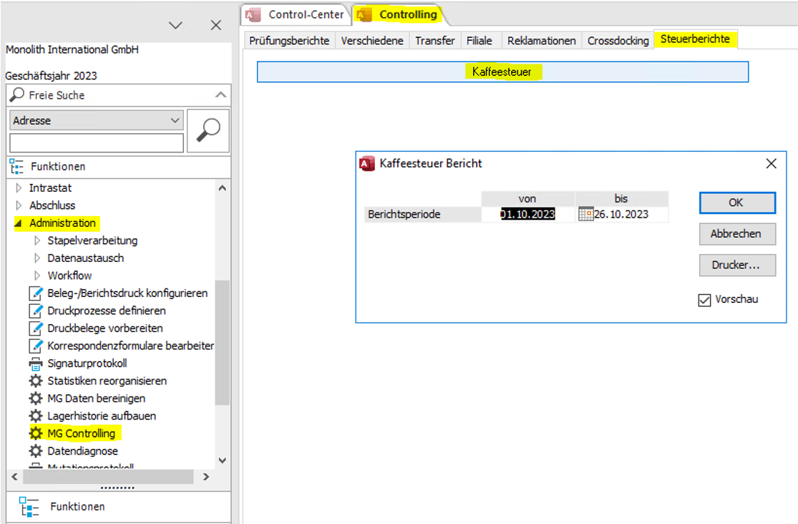
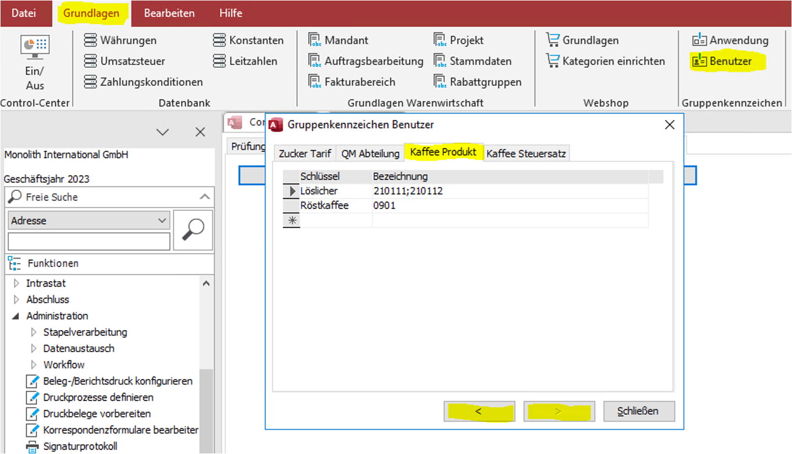

# **Проекты Sage**
---
##**Проект "Kaffeesteuer"**  
`разработчик - Maksim Andreev`  
  
Отчет "Kaffesteuer" находится в разделе Sage - Administration --> MG Controlling --> Steuerberichte --> Kaffeesteuer  
     
Внимание: в отчет попадают только правильно настроенные данные!  
**Настройка Stammdaten для отчета:**  
Sage - Меню на верхней панели "Grundladen --> Benutzer --> ", далее пролистать стрелками в нижней части открывшегося окна "Gruppenkennzeichen Benutzer" до появления закладок "Kaffee Produkt" и "Kaffee Steuerzatz".  
**Для "Kaffee Produkt":**  
**Schlüssel** - тип кофе ("Röstkaffee" или "Löslicher")  
**Bezeichnung** - начальные цифры соответствующих Warennummer (разделитель ";" без пробелов и кавычек!)  
     
**Для "Kaffee Steuersatz":**  
**Schlüssel** - подтип кофе, где:  
первые две цифры - порядковый номер для вывода в отчете;  
третья буква соответствует типу кофе "R" - Röstkaffee, "L" - Löslicher;  
после буквы указывается диапазон содержания кофе в граммах на кг продукта, при этом число 1000 заменяется на "1K"  
Пробелы не допускаются, используются только цифры, буквы латинского алфавита и знак "-", как в образце!  
**Bezeichnung** - ставка налога  
     
В **Stammdaten --> Artikel** необходимо указать для кофе признак "ist Kaffee" = "ja" и содержание кофе "Gehalt Gr./Kg." (значение от 10 до 1000)  
     
В случае наличия ошибок в настройках Stammdaten перед открытием отчета будет сообщение:  
     
На рабочем столе пользователя будет сохранен и открыт файл Excel с перечнем артикулов с ошибочными Stammdaten.  
В приведенном примере не указан признак "Ist Kaffee" и не заполнено содержание кофе в граммах, но при этом начальные цифры Warennummer соответствуют информации, указанной в настройках "Grundladen --> Benutzer -->  Kaffee Produkt".  

     