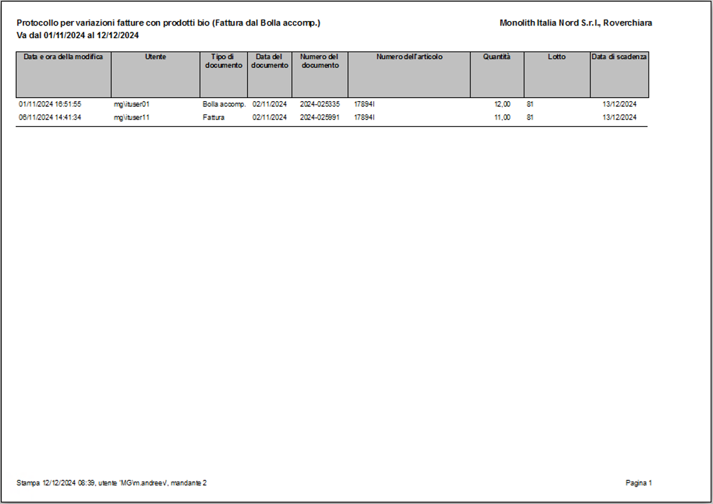
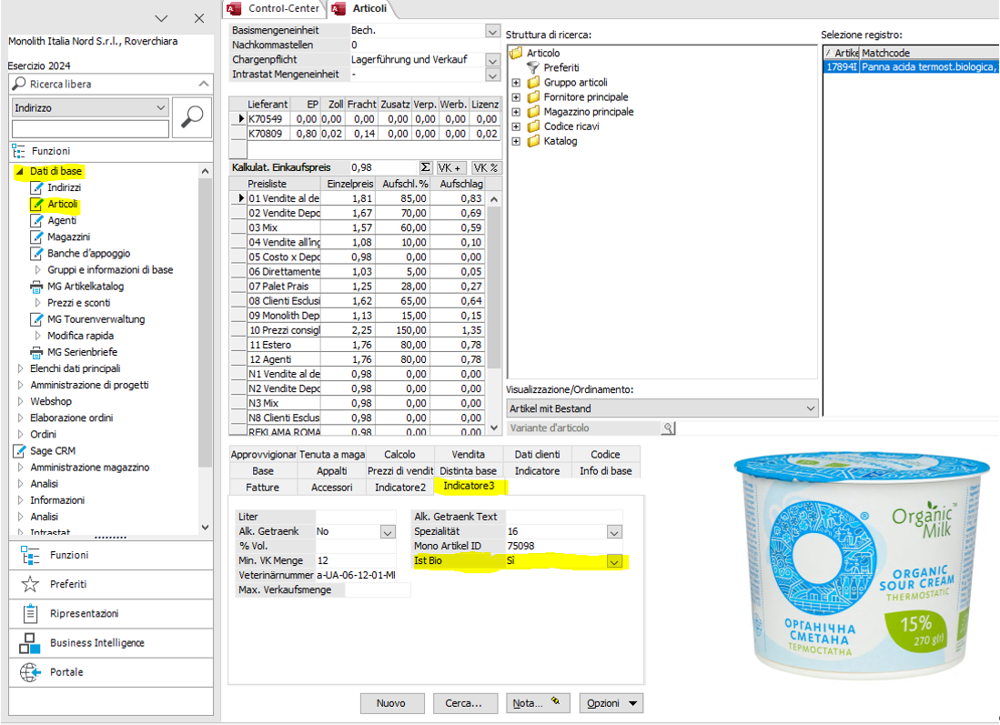
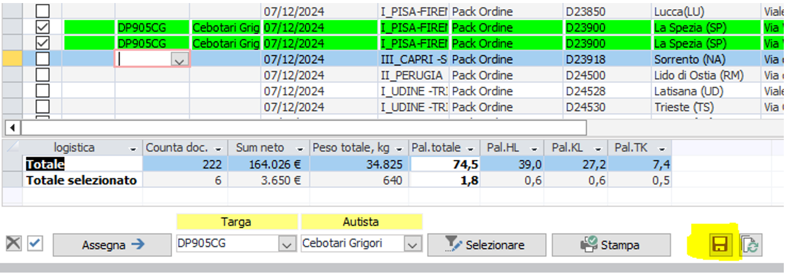
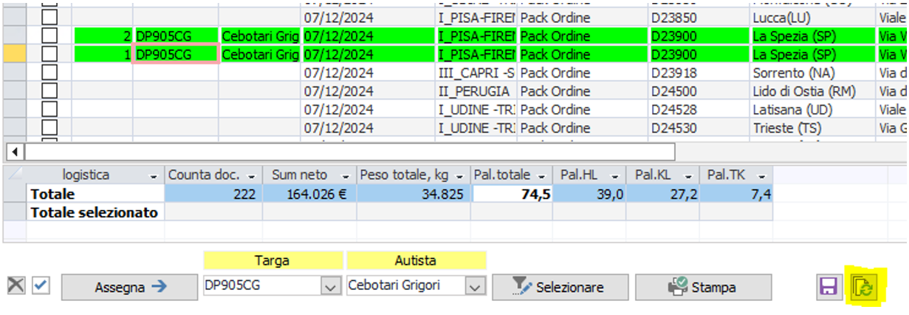

# **Проекты Sage**
---
##**Проект "БИО-продукция"**  
👨🏻‍💻 [разработчик - Maksim Andreev](../about/#maksim-andreev)  
  
1. В меню «Amministrazione» открываем «MG Controlling». На закладке «Steuerberichte» в нижней части экрана нажимаем кнопку «BIO LOG (MIV)». Выбираем период и режим отчета (по дате изменений или по дате документа).  
     
   Открывается отчет (в отчет входят только изменения количества в партиях товара по BIO продукции в документах «Bolla accomp.» и «Fattura»).  
     
2. Второй отчет (об изменениях количества в партиях товаров по BIO продукции в документах «Fattura» по сравнению с «Bolla accomp.», на основе которой эти документы были созданы) запускается аналогичным образом через кнопку «BIO Bolla in Fattura (MIV)».  
     
   Отчет отображает изменения, сгруппированные по парам «Bolla accomp.» - «Fattura»  
     
3. Настройка в артикулах:  
   Для корректного формирования отчета по артикулам с биопродукцией поле «Ist BIO» должно иметь значение «Si».  
     
   ВАЖНО: данные, по которым формируется первый отчет «BIO LOG (MIV)», создаются в момент редактирования документа. Поэтому поле «Ist BIO» должно быть заполнено до изменений документов.
---
##**Проект "Маршрутный лист"**  
👨🏻‍💻 [разработчик - Maksim Andreev](../about/#maksim-andreev)  
  
В окне «Tour» выбираем необходимую дату. На закладке «Logistik» в нижней части экрана нажимаем кнопку «Schelda di tour».  
  
Открывается список туров за выбранный день с группировкой по клиентам и адресам доставки.  
  
Для назначения автомобиля и водителя необходимо отметить «галочкой» соответствующие строки, выбрать «Targa» и «Autista» в нижней части экрана и нажать «Assegna».  
  
Для сохранения произведенных изменений необходимо нажать кнопку «Сохранить» справа внизу (кнопка доступна только одному пользователю Sage, который формирует маршрутные листы).  
  
В случае необходимости выбора (проставления «галочек») уже назначенным автомобилям с водителями нужно выбрать внизу экрана «Targa» и «Autista» и нажать «Seliyionare».  
  
Строки с соответствующими автомобилями и водителями будут выделены «галочками».  
  
Для печати маршрутного листа по выделенным строкам нужно нажать кнопку «Stampa».  
  
Внимание: для маршрутного листа должен быть обязательно заполнен порядковый номер «Punti», номер автомобиля и водитель.  
  
  
При работе в течение дня информация о турах может изменяться. Для актуализации данных о турах необходимо нажать кнопку «Обновить» справа внизу экрана.  
  
**Дополнительная информация:**  
Назначение кнопок слева внизу экрана:  
 - выделить все строки, отображаемые на экране  
 - снять выделение строк, отображаемых на экране  
**Редактирование списка водителей:**  
  
  