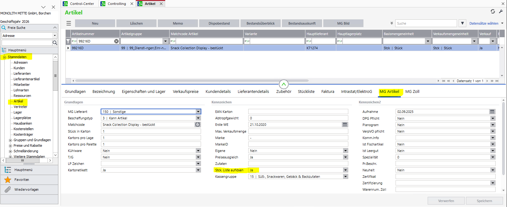
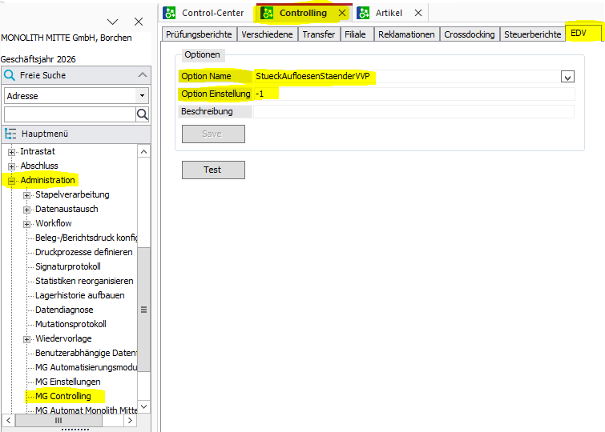

# **Проекты Sage**
---
##**Проект "Stückliste Ständer auflösen"**  
👨🏻‍💻 [разработчик - Maksim Andreev](../about/#maksim-andreev)  
  
В Sage добавлена опция «StueckAufloesenStaenderVVP» (значение "-1"), которая в сочетании со значением "Ja" свойства артикула «Stck. Liste auflösen» включает раскрытие содержимого Stückliste на этапе создания Packauftrag, при этом **не требуется наличие** на складе всех артикулов, содержащихся в Stückliste.  
**Внимание:** При значении "0" опции «StueckAufloesenStaenderVVP» в сочетании со значением "Ja" свойства артикула «Stck. Liste auflösen» раскрытие содержимого Stückliste на этапе создания Packauftrag произойдет **только при наличии** на складе всех артикулов, содержащихся в Stückliste, иначе позиция Stückliste будет удалена из Packauftrag со всем её наполнением.
     
     
