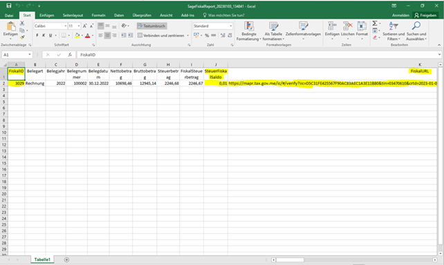
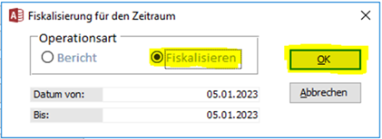
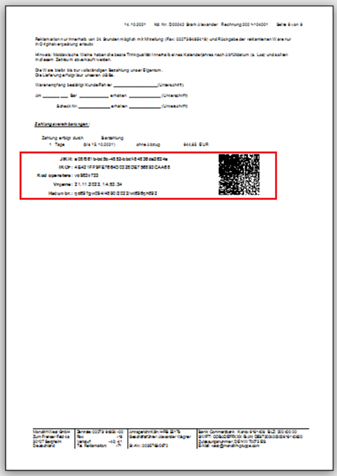
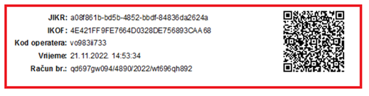

# **Проекты Sage** 
## **Фискализация (Fiskalisierung)** 
### **Важные моменты в проведении фискализации документов в Sage**  
* Фискализация в Sage происходит автоматически после создания каждого документа типа Rechnung, Gutschrift, Stornorechnung.  
* Признак успешной фискализации - наличие QR кода на документе.  
* Обязательные условия для проведения фискализации:  
– наличие PIB клиента в соответствующем поле Sage для клиентов из Montenegro (для иностранных клиентов в данном поле должен быть указан уникальный ID клиента)  
–  документ типа Gutschrift или Stornorechnung должен быть связан в Sage с оригинальным документом  
–  дата документа должна быть раньше или равна текущей системной дате  
* Если фискализация не прошла автоматически, необходимо запустить этот процесс «вручную»  
(см. Инструкцию ниже).  
* Запрещается вносить изменения в фискальный документ после того, как он был фискализирован.  
* Фискальные суммы документа могут отличаться от сумм документов в Sage на несколько центов за счет разницы в округлении. С целью контроля отличия суммы налога в документе и его фискальных реквизитах в отчетах Sage предусмотрено поле «FiskalSaldo».  
### **Дополнения, внесенные в интерфейс Sage для работы с фискализацией счетов**
1. В меню **Stammdaten->Adressen** на закладке **Info** добовлено поле **PIB**, заполнение которого является ОБЯЗАТЕЛЬНЫМ для успешного проведения фискализации документов по данному клиенту (для иностранных клиентов в это поле вносится их уникальный ID).  
      
2. В меню **Administration->Controlling** на закладке **Transfer** добовлена кнопка **Rechnung Fiskalisieren (Montenegro)** для проведения фискализации вручную, если автоматическая фискализация по какой-либо причине не сработала.  
     
   После нажатия кнопки **Rechnung Fiskalisieren (Montenegro)** открывается окно **Rechnung Fiskalisieren**  
   
      **Вариант 1: фискализация документа, который отсутствует в отчетах о фискализации:**  
        
      
      Для фискализации «вручную» необходимо ввести данные фискализируемого документа и нажать «**ОК**». Будет запущена процедура фискализации документа.  
      
      **Вариант 2: фискализация документа, информация о котором присутствует в отчетах о фискализации:**  
        
      Дополнительно поставить галочку **Laden Fiskaldaten aus dem Fiskalbericht** и указать "Fiskal ID" документа из отчета по фискализации (такая ситуация будет встречаться крайне редко, только в случаях, если фискальные данные сохранились на стороне налоговой службы, но не записались в базу данных Sage).  
   
3. **Формирование отчета по фискализации**  
   В меню **Administration->Controlling** на закладке **Transfer** добовлена кнопка **Fiskalisierung für den Zeitraum** для просмотра отчетов и проведения фискализации вручную за период времени.  
     
   Для формирования отчета по фискализации необходимо указать период времени и нажать ОК  
     
4. В случае ошибки сначала откроется окно «Fiskalisierung prüfen». Если ошибок нет, то сразу открывается отчет (пункт 5)  
     
   После двойного щелчка мышью на поле с ошибкой (красного цвета) откроется соответствующее окно для проведения фискализации «вручную». Достаточно просто нажать «Ок»  
     
     
   В итоге окно «Fiskalisierung prüfen» должно стать пустым. После этого окно можно закрыть  
      
   
5. После закрытия окна «Fiskalisierung prüfen» откроется отчет в формате Excel.  
   Отчет формируется в виде двух файлов: «SageFiskalReport» (все документы Sage за указанный период, которые требуют фискализации, с указанием фискальных данных при наличии) и «FiskalReport» (все фискальные документы, сохраненные в базе данных налоговой службы за указанный период, с указанием реквизитов соответствующих документов из Sage). В обоих отчетах поля Belegnummer и FiskalID не должны быть пустыми.  
      
      
   
6. **Fiskalisierung für den Zeitraum** можно также использовать для проведения фискализации «вручную» всех нефискализированных документов за указанный период времени. Для этого нужно выбрать вид операции **Fiskalisieren** и нажать OK:  
     
   При этом будут профискализированы все дукументы, подлежащие фискализации, по которым в Sage отсутствуют фискальные данные.   
   
7. Для Montenegro добавлены фискальные данные в печатных формах Sage (последняя страница фискального документа):  
     
     
   
## **Проверка цен (Preischeck)** 
Отчет для подразделений Montenegro, который отображает расхождения между ценами MNES в сравнении с другими подразделениями Montenegro (MNE, MNEI, MNED, MNEL).  
Сравнение производится только по активным артикулам MNES.  
Отчет формируется ежесуточно в ночное время.  
В случае выявления расхождений в ценах отчет отправляется на согласованные с Заказчиком адреса электронной почты:  

racunovodstvo@monolith-gruppe.com;  
d.kisler@monolith-gruppe.com;  
v.artemyeva@monolith-gruppe.com;  
v.artemyev@monolith-gruppe.com;  
a.frank@monolith-gruppe.com.  

Пример отчета:

Для возможности запуска проверки вручную в разделе "Transfer" меню Sage "Administration-->MG Controlling" добавлены кнопки:

* Montenegro Preischeck (Bericht) - проверить корректность цен;
* MNES Preise Übernehmen - передать исправленные цены от MNES другим подразделениям Montenegro

ВАЖНО: процедуру возможно запустить только от имени подразделения MNE Service.

